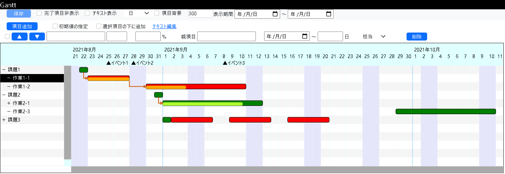

# MyGantt
JavaScriptとsvgの勉強で作成したガントチャート描画・編集処理

- jsの関数へ渡すデータは「frappe/gantt」を参考にしています  
作業バラシのために上記を使用していたのですが、個人的に使い難い箇所があったため自作しました

- 描画には「svg.js」を使用しています  
「svg.js」はリポジトリには含まれていないため、ダウンロードしてjsフォルダに置いてください

- こんな感じで表示されます



## ファイル構成
リポジトリに登録しているファイルはローカルPCで使用する構成になっています  
Webシステムに組み込む場合は最低限★のファイルをそのまま使用、他ファイルは捨てて作り直せばいけるはず・・・
<pre>
src
├── css
│   ├── config.css          作業者毎の見た目設定
│   └── MyGantt.css         ★デフォルトの見た目
├── js
│   ├── svg.js              ★svg.jsのフォルダ、Webからダウンロードして配置してください
│   │   └── svg.min.js
│   ├── config.js           頻繁に変更することがない設定(休日、イベント、作業者)
│   ├── MyGantt.js          ★ガントチャートの本体
│   └── tasks.json          設定(タスク、表示の尺度、高さ)
└── MyGantt.html            MyGantt.jsの使い方のサンプル
</pre>

## リファレンス一覧
編集をしないのであればコンストラクタとdrawGanttしか使わない

|関数|機能|
|-|-|
|MyGantt(tasks, div_id, svg_id, config)|コンストラクタ|
|readHistory()|ログ取得|
|writeHistory(record)|ログに追記 ※最大8項目、超えた場合は古いものから消える|
|getTasks()|全タスクの情報を取得 ※データ構造は別途記載|
|upTask(id)|idでしていたいタスクの位置を一つ上げる|
|downTask(id)|idでしていたいタスクの位置を一つ下げる|
|updateTask(id, task)|idで指定したタスクの情報を更新する|
|addTask(task, next='')|タスクを追加する|
|deleteTask(id)|idで指定したタスクを削除する|
|textToArray|,区切りの文字列を配列に変換する ※親項目の指定で使用|
|drawGantt(range=this.config.range)|描画処理|
|changeRange(range=this.config.range)|表示の尺度を変更(Quarter、Month、Week、Day)|
|changeHeight(height)|高さを変更|
|changeViewComplete(complete)|進捗が100%の項目の表示・非表示を切替|
|changeViewText(text)|タスクのバーの項目名の表示・非表示を切替|
|changeTaskClose(id)|idで指定したタスクに連なる階層の低いタスクの開閉を切替|
|changeTaskbg(taskbg)|タスク名表示の背景色を切替(デフォルト、作業者の色)|
|selectTask(id='')|タスクの選択・選択解除を切替|

## 使い方
表示するだけであれば以下で使用できる

```html
<!DOCTYPE html>
<head lang="ja">
  <!-- Required meta tags -->
  <meta charset="utf-8">
  <meta http-equiv="X-UA-Compatible" content="IE=edge">
  <meta name="viewport" content="width=device-width, initial-scale=1">
  <!-- Bootstrap CSS -->
  <link rel="stylesheet" href="https://cdn.jsdelivr.net/npm/bootstrap@5.0.0-beta1/dist/css/bootstrap.min.css">
  <!-- MyGannt CSS -->
  <link rel="stylesheet" href="./css/MyGantt.css">
  <!-- CSS -->
  <style>
    .navbar-nav > li {
      font-size: 12px;
    }
    .btn-primary {
      font-size: 12px;
    }
    .btn-link {
      font-size: 12px;
    }
    .form-control {
      font-size: 12px;
    }
    .form-select {
      font-size: 12px;
      border: 1px;
    }
    .form-range {
      height : 12px;
      width : 400px;
    }
    label {
      font-size: 12px;
    }
    input {
      font-size: 12px;
    }
  </style>
  <title>Gantt</title>
</head>
<body>
  <!-- Optional JavaScript; choose one of the two! -->
  <!--
  <script src="#"></script>
  -->
  <!-- Option 1: Bootstrap Bundle with Popper -->
  <script src="https://cdn.jsdelivr.net/npm/bootstrap@5.0.0-beta1/dist/js/bootstrap.bundle.min.js"></script>
  <!-- Option 2: MyGannt -->
  <script src="./js/svg.js/svg.min.js"></script>
  <script src="./js/MyGantt.js"></script>

  <div class="my-1" id='MyGanttDiv'>
    <svg id="MyGantt"></svg>
  </div>
  <script>
    var gantt = null;
    var tasks  = [{"name":"課題1","start":"2021-08-22","days":10}];

    try{
      gantt = new MyGantt(tasks, 'MyGanttDiv', 'MyGantt', {
        'height'  : 300,
        'range'   : 'Day',
      });
      gantt.drawGantt();
    }
    catch(ex){
      document.write(ex);
    }
  </script>
</body>
</html>
```

コンストラクタで渡すtasks、getTasksで取得できる全タスクの情報はのデータ構造は以下

```js
tasks = [
  {
    "id":"課題1",                   コンストラクタでnameと同じ値に振り直される
    "name":"課題1",                 タスクの表示名
    "layer":"1",                    タスクの階層(1～5、数値が小さいほど階層が高くなる)
    "progress":"0",                 タスクの進捗(0～100)
    "dependencies":[],              親タスクのリスト(idの配列)
    "start":"2021-08-22",           タスクの開始日
    "days":10,                      タスクの作業日数
    "close":0,                      タスクに連なっている階層の低いタスクの開閉(0=閉、1=開)
    "custom_class":""               担当者名
  }
];
```

コンストラクタで指定できるconfigの内容は以下

|名称|機能|
|-|-|
|onclick|マウスで項目がクリックされたときにコールバックされる関数|
|onchange|項目が変更されたときにコールバックされる関数|
|height|ガントチャートの高さ|
|range|表所の尺度|
|holiday|日付の配列、この日付は土日と同じ色でハイライトされる|
|events|イベントのリスト|
|complete|進捗が100%の項目の表示・非表示設定(true、false)|
|text|タスクのバーの項目名の表示・非表示設定(true、false)|
|taskbg|タスク名の背景の表示・非常時設定(true=担当者の色、false=デフォルト)|

## 「MyGantt.html」の操作方法

|機能|操作方法|
|-|-|
|「保存」ボタン|1.「保存」ボタンを押すとガントチャートの変種内容がDonloadフォルダに保存される<br>　※既存のファイルの上書きはできません<br>　※変更がないときにはボタンが無効になっている|
|コンボボックス<br>(「日／週／月／四半期」)|1.項目を切り替えると表示されているガントチャートの1マスの縮尺が変わる|
|「項目追加」ボタン|1.初期値を指定したい場合はチェックを入れると、「項目変更」ボタンの左のコントールを使って指定できる<br>　※項目名、開始日、終了日、親項目、担当を指定可能<br>2.選択した項目の次の行に追加したい場合はチェックを入れる<br>3.「項目追加」ボタンを押すと新規項目が追加される|
|「▲」ボタン<br>「▼」ボタン|1.マウスで項目をクリックして選択する<br>2.「▲」ボタンで項目の位置を一つ上で移動、「▼」ボタンで項目の位置を一つ下へ移動|
|項目の階層<br>(項目名の横にある入力欄)|階層を指定できる<br>階層を指定すると項目をダブルクリックすることで下の階層の項目を折りたたむことができるようになる|
|同一行に表示<br>(「▲」ボタンの左のチェックボックス)|チェックを入れた項目は項目を折りたたんだときも表示されるようになる|
|親項目|設定されている項目からの矢印が引かれる、複数の項目から引きたい場合は「,」区切りで記載する<br>マウス操作でも可能<br>1. 項目を選択する<br>2. 「Ctrl」キーを押しながら親項目に設定／解除したい項目を選択する|
|「削除」ボタン|1.マウスで項目をクリックして選択する<br>2.「削除」ボタンを押すと選択した項目が削除される|
|マウス操作|項目の開始日、終了日を変更することができる|
